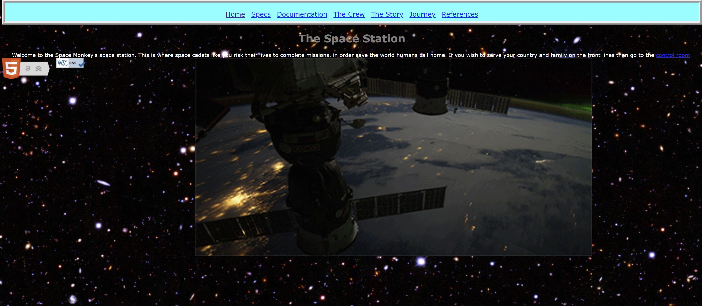
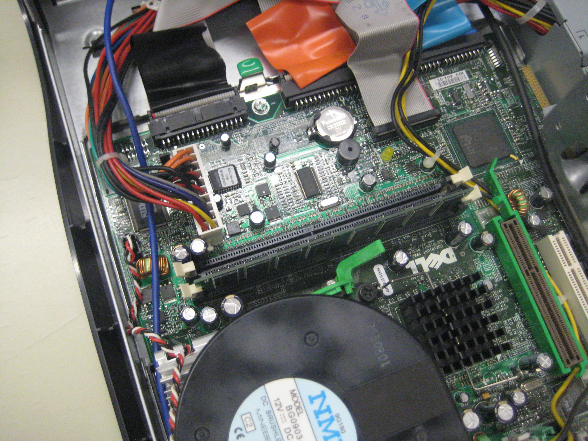

# Disassembly and Reassembly of a Dell System Unit

## Brief Introduction
I worked with a team of three other students to take apart a Dell System Unit and identify its hardware components. After reassembling the PC, we booted the computer using the Ubuntu operating system. This process was documented using HTML and CSS in the project files. The purpose of this project was to mainly exhibit our interests in learning about computer hardware.

<i>Note that .wmv files in Videos directory are uploaded to remote repository using Git LFS due to size restrictions.</i>

## Website Preview

## Assembly Preview

-----------------------------------------------------------------------------------------------------------------

